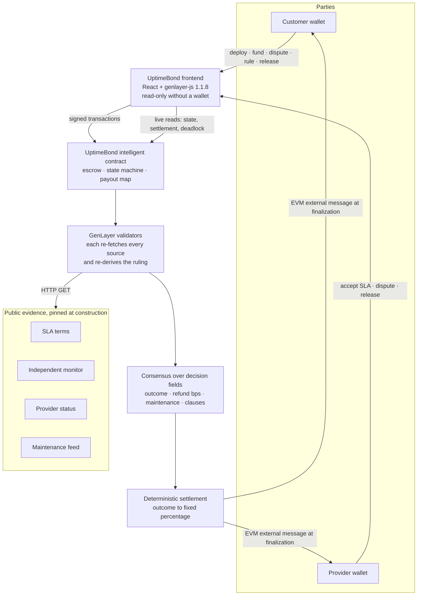

# UptimeBond

**Escrow that settles service-level disputes using GenLayer validator consensus.**

[](https://github.com/GIFTEDLOV/uptimebond/actions/workflows/ci.yml)
[-8a6a3b)](https://explorer-bradbury.genlayer.com/)
[](docs/pilot/runs/2026-07-29-pilot.md)
[-6b6b6b)](frontend/package.json)
[](https://github.com/GIFTEDLOV/uptimebond/releases/tag/v1.0.1-bradbury-pilot)


---

## Live links

| | |
|---|---|
| **Application** | https://uptimebond.vercel.app |
| **Repository** | https://github.com/GIFTEDLOV/uptimebond |
| **Canonical contract** | [`0x5006115944D7F593E401239aeDb64abEF13dCc0a`](https://explorer-bradbury.genlayer.com/address/0x5006115944D7F593E401239aeDb64abEF13dCc0a) |
| **In the app** | [uptimebond.vercel.app/agreement/0x5006…dCc0a](https://uptimebond.vercel.app/agreement/0x5006115944D7F593E401239aeDb64abEF13dCc0a) |
| **Release** | [`v1.0.1-bradbury-pilot`](https://github.com/GIFTEDLOV/uptimebond/releases/tag/v1.0.1-bradbury-pilot) |
| **Pilot record** | [`docs/pilot/runs/2026-07-29-pilot.md`](docs/pilot/runs/2026-07-29-pilot.md) |

Testnet only. No real funds, no sign-up, no custody.

---

## The problem

Service level agreements are promises about facts — "99.5% uptime this month" —
but the facts are held by the party with the least interest in reporting them
honestly. When a customer believes the SLA was breached and the provider
believes it was not, every available option is bad:

- **Trust the provider's status page.** The provider grades its own homework and
  decides what counts as planned maintenance.
- **Escalate to support.** Slow, opaque, and the provider still decides.
- **Litigate or arbitrate.** Costs more than the service credit is worth, so in
  practice the customer absorbs the loss.
- **Escrow with a middleman.** Now someone else holds the money and *also*
  decides. The custody risk is real and the adjudication is still centralized.

The dispute is usually small, factual and repetitive — exactly the shape that
should be automatable, and exactly the shape no existing mechanism handles at a
proportionate cost.

## The solution

UptimeBond is an on-chain SLA escrow that adjudicates itself.

1. **An immutable agreement is created.** The customer deploys an intelligent
   contract naming the provider, the settlement terms and the evidence. None of
   it can be edited afterwards.
2. **Testnet GEN is held in escrow.** The contract itself custodies the payment.
   Neither party — and no operator — can move it outside the settlement rules.
3. **Four public evidence sources are pinned at construction.** Commit-pinned
   URLs, fixed forever, agreed by both parties before the provider accepts.
4. **Either party can open a dispute** over a stated incident window.
5. **Every validator independently re-fetches the evidence** and derives the
   ruling from it. The contract does not distribute the evidence and does not
   trust any one reader of it.
6. **The ruling maps to a fixed payout percentage.** Validators return a
   structured decision, never an arbitrary amount.
7. **Funds move only at finalization.** Payouts are EVM external messages that
   execute when the transaction finalizes, so nothing is paid on an unfinalized
   ruling that could still be appealed.

## Why GenLayer is necessary

This is not a normal smart contract, and it is not an oracle problem either.

**The input is a semantic judgement over public documents.** "Was 99.1% uptime
a breach of a 99.5% commitment, given a maintenance window announced 2 hours
ahead of a clause requiring 24?" A conventional contract cannot read an SLA. An
oracle can deliver a number but cannot interpret a clause.

**The parties are adversarial and neither can be trusted to run the model.** If
the provider runs the LLM, the customer has no reason to accept the output.
Reverse it and the provider does not either. A single API call is unverifiable
after the fact — nothing stops an operator re-rolling until they like the answer.

**Model output is non-deterministic, so ordinary consensus cannot settle it.**
Two honest validators asked the same question will word their reasoning
differently. GenLayer's optimistic democracy takes consensus over the
*structured decision fields* — outcome, refund bps, maintenance qualification,
breached clause IDs — and never over the prose, which is retained as explanation
only.

**The financial consequence stays deterministic.** The validators choose among
four outcomes. The contract, not the model, converts an outcome into a payout.
An LLM cannot invent a percentage, name a recipient, or move value.

That combination — non-deterministic reasoning reduced to a consensus-backed
decision, then applied by deterministic on-chain logic — is what GenLayer
provides and what nothing else in the stack does.

---

## Product walkthrough

### 1 · Create the agreement

The customer names the provider, describes the service, pins four evidence
sources and sets the settlement terms. Each source must return HTTP 200 before
the step will advance — an unreachable source guarantees a failed ruling later,
so the wizard refuses to carry one forward.


### 2 · Fund, accept, dispute

The customer funds the escrow, sends the provider an invitation link, and the
provider accepts the SLA from their own wallet — which is the moment the
agreement becomes binding on both sides. Either party can then open a dispute
over a stated incident window.

These three states are not shown as separate screenshots: the canonical contract
below has already settled, and re-staging `AWAITING_FUNDING`,
`AWAITING_PROVIDER_ACCEPTANCE` and `DISPUTED` would mean deploying another
agreement and spending GEN. The run sheet in
[`docs/pilot/PILOT-RUN.md`](docs/pilot/PILOT-RUN.md) documents each step, and
the lifecycle strip in the next screenshot shows the path the live agreement
actually took.

### 3 · The settled agreement

Everything below is read live from the contract at
`0x5006115944D7F593E401239aeDb64abEF13dCc0a`. No wallet is needed to read it.

![Agreement page for contract 0x5006115944D7F593E401239aeDb64abEF13dCc0a. A settlement panel reads "Partial refund", customer refund 25% (2500 bps), provider share 75%, with a Payout finalized badge and three figures: customer receives 0.0025 GEN, provider receives 0.0075 GEN, contract balance 0 GEN fully distributed. Below it the agreement details show escrow 0.01 GEN, the customer and provider addresses and the incident window, and a lifecycle strip runs Awaiting Funding, Awaiting Provider Acceptance, Active, Disputed, Ruled, Resolved with Resolved as the current step](docs/assets/screenshots/03-agreement-overview.png)

### 4 · The validator ruling

The decision fields consensus was taken over, plus the reasoning one validator
wrote to explain them.

![Ruling panel reading Partial refund, with customer refund 25% (2500 bps), provider share 75%, maintenance qualified "No — downtime counts in full", and breached clause SLA-1 "Uptime commitment — at least 99.50% of the service period". An expanded Validator reasoning disclosure explains that the independent monitor reported 99.1% uptime against a 99.5% commitment and that the 5-hour downtime event was announced only 2 hours ahead, failing the SLA-2 24-hour notice requirement. A footnote states that reasoning is explanatory only and consensus is taken over the decision fields](docs/assets/screenshots/04-validator-ruling.png)

### 5 · Settlement

Payout completion is derived from the contract's live native balance, never from
its status. `RESOLVED` means the transfer was queued; only the balance reaching
zero proves anyone was paid.


### 6 · Evidence, fixed forever


---

## Lifecycle

```
AWAITING_FUNDING
      │  fund()                       customer transfers the escrow
      ▼
AWAITING_PROVIDER_ACCEPTANCE
      │  accept_sla()                 provider commits to the pinned terms
      │  cancel_before_acceptance()   customer withdraws, full refund ──► RESOLVED
      ▼
ACTIVE
      │  approve_service()            customer confirms no breach ────────► RESOLVED
      │  open_dispute(window)         either party, requires a window
      ▼
DISPUTED
      │  rule()                       validators re-fetch and adjudicate
      ▼
RULED
      │  release()                    settles per the ruling, single-shot
      ▼
RESOLVED
```

**The insufficient-evidence branch.** If the validators cannot support a
financial ruling they return `INSUFFICIENT_EVIDENCE`, and `release()`
deliberately reverts — there is no automatic settlement to apply, and inventing
one would be worse than stopping. The escrow stays custodied while three exits
remain open:

- **Mutual settlement.** Either party proposes a refund split; the counterparty
  accepts. The proposer cannot accept their own proposal.
- **Native appeal.** GenLayer's transaction appeal re-adjudicates the `rule`
  transaction. There is no custom AI re-ruling method.
- **Deadlock fallback.** After a deadline fixed at construction,
  `resolve_deadlock()` settles at a pre-agreed split so the escrow can always be
  freed without an off-chain coordinator.

## Ruling model

Validators choose one of exactly four outcomes. The contract owns the map from
outcome to money:

| Outcome | Customer | Provider | Settles automatically |
|---|---|---|---|
| `NO_BREACH` | 0% | 100% | yes |
| `PARTIAL_REFUND` | 25% (2500 bps) | 75% | yes |
| `FULL_REFUND` | 100% | 0% | yes |
| `INSUFFICIENT_EVIDENCE` | — | — | **no** — escrow stays custodied |

**Validators do not invent payout percentages.** They cannot name a recipient,
choose an amount, or move value. The percentages above are constants in
`contracts/uptime_bond.py`; the model's only financial influence is selecting
which of the four rows applies. Prompt content that tries to instruct a payout
has nowhere to land.

## Evidence model

Four public URLs, pinned at construction and immutable thereafter:

| Source | Role in adjudication |
|---|---|
| **SLA terms** | The authoritative clauses. What the provider is actually held to. |
| **Independent monitor report** | Primary operational evidence. UptimeBond does not monitor anything itself. |
| **Provider status record** | Corroborating. The provider's own account of the period. |
| **Maintenance announcements** | Corroborating. Decides whether downtime qualifies for exclusion. |

Two properties matter more than the list:

**The contract never distributes the evidence.** Each validator fetches every
URL itself during adjudication and re-derives the ruling. A leader cannot feed
its peers a convenient copy.

**URLs should be commit-pinned.** A source that changes between the leader's
fetch and a validator's makes honest validators disagree. The create wizard
warns when a URL looks mutable, and the pilot used sources pinned to a git
commit.

---

## Verified Bradbury pilot

A fresh agreement, deployed from the browser and driven end to end on
**2026-07-29** by two independent wallets in two browser profiles. No scripts.

**Contract:** [`0x5006115944D7F593E401239aeDb64abEF13dCc0a`](https://explorer-bradbury.genlayer.com/address/0x5006115944D7F593E401239aeDb64abEF13dCc0a)

| # | Method | Signer | Transaction | Validators | Execution |
|---|---|---|---|---|---|
| 1 | `deploy` | customer | [`0x8a8befa0…dafbafcc`](https://explorer-bradbury.genlayer.com/tx/0x8a8befa0332b4c73ac2ab09fb655fe9f38e1569b00130c99129c7930dafbafcc) | 5 AGREE | `FINISHED_WITH_RETURN` |
| 2 | `fund` · 0.01 GEN | customer | [`0xd95dce3c…e35e056672`](https://explorer-bradbury.genlayer.com/tx/0xd95dce3cec29a55ccd6821fde43e3b43f22d239b06bcec09563449e35e056672) | 5 AGREE | `FINISHED_WITH_RETURN` |
| 3 | `accept_sla` | provider | [`0x47f95e8f…1695a82e`](https://explorer-bradbury.genlayer.com/tx/0x47f95e8f9956ae99ee7154059ac86aa5dfa5f4882561d27b1dcf85cc1695a82e) | 5 AGREE | `FINISHED_WITH_RETURN` |
| 4 | `open_dispute` | customer | [`0xab3cfd69…fab6cad9`](https://explorer-bradbury.genlayer.com/tx/0xab3cfd69cfcf553f5f61628aeb1f76f6694bbcc7a5e56833027cfb68fab6cad9) | 5 AGREE | `FINISHED_WITH_RETURN` |
| 5 | `rule` | customer | [`0xb151be00…cb282ae4`](https://explorer-bradbury.genlayer.com/tx/0xb151be00c6f1802d513afef8733ed7eb5a33ce14c8dea49f109f53b8cb282ae4) | 3 AGREE, 2 TIMEOUT | `FINISHED_WITH_RETURN` |
| 6 | `release` | customer | [`0xbd6922e8…56a4ed3f`](https://explorer-bradbury.genlayer.com/tx/0xbd6922e842d468b3bd1623c889bac282a1b843b36b5af8e57f211aef56a4ed3f) | 5 AGREE | `FINISHED_WITH_RETURN` |
| 7 | `release` — **duplicate, rejected** | provider | [`0x7f9aad2f…df83da10`](https://explorer-bradbury.genlayer.com/tx/0x7f9aad2fd451e35a8f726d27f86ca61506c4745d6f9faddcd5e94b9fdf83da10) | **5 DISAGREE** | **`FINISHED_WITH_ERROR`** |

**Verified result** — read back from the contract, not inferred from status:

| | |
|---|---|
| Escrow | **0.01 GEN** |
| Outcome | **`PARTIAL_REFUND`**, 2500 bps, breached `SLA-1`, maintenance not qualified |
| Customer received | **0.0025 GEN** (25%) |
| Provider received | **0.0075 GEN** (75%) |
| Final contract balance | **0** |
| `payout_complete` | **`true`** |
| Deployed source | 33,517 bytes, `04fe3a7b…` — byte-identical to `contracts/uptime_bond.py` |

### The rejected duplicate release

Row 7 was not planned, and it is the most useful row in the table.

Twenty-seven seconds after the customer created the release, the provider
created a second one. **This was a competing transaction submitted while the
first release was still unfinalized** — Bradbury queued it in the next slot, and
by the time it executed the agreement had reached `RESOLVED`. The single-shot
guard refused it: 5/5 DISAGREE, `FINISHED_WITH_ERROR`, **no state change and no
additional funds moved.** The settlement on-chain is the first release,
unchanged, and the balance is zero.

**The frontend could not have prevented this.** At the moment of submission the
contract genuinely still read `RULED`, because an in-flight transaction is
invisible in contract state, and the two parties were in separate browser
profiles with no shared local state to compare. Commit `0505189` hardened the UI
against acting on state it has not re-read, and that is worth having — but it
closes the case where state has *already* moved, not this race. Two parties can
always submit competing writes inside one finality window. Only the contract can
arbitrate that, and it did.

Full analysis: finding **F2** in
[`docs/pilot/runs/2026-07-29-pilot.md`](docs/pilot/runs/2026-07-29-pilot.md).

### Earlier verified agreements

Four scripted agreements from July 2026, each driven
`deploy → fund → accept → dispute → rule → release` with escrow movement
measured across the release finalization boundary:

| Case | Outcome | Contract | Measured settlement |
|---|---|---|---|
| 001-v2 | `NO_BREACH` | [`0xa0c10C65…E2cFFe`](https://explorer-bradbury.genlayer.com/address/0xa0c10C656692B4A8E44357d342C38C3DEEE2cFFe) | provider 0.1 GEN, balance 0 |
| 002-v2 | `PARTIAL_REFUND` | [`0x965C9B45…1750d5`](https://explorer-bradbury.genlayer.com/address/0x965C9B454867273F612BD48d181Ec418391750d5) | customer 0.025, provider 0.075, balance 0 |
| 003-v2 | `FULL_REFUND` | [`0xDF1A19AC…2f4676`](https://explorer-bradbury.genlayer.com/address/0xDF1A19ACBE068373f067EF6E226EE564032f4676) | customer 0.1 GEN, balance 0 |
| 004-v2 | `INSUFFICIENT_EVIDENCE` | [`0x44DF7689…785F7d`](https://explorer-bradbury.genlayer.com/address/0x44DF768956c15f3B9aFBe82A08dAcB4a9A785F7d) | `release()` **rejected**, 0.1 GEN custodied by design |

> **⚠️ Do not fund these deprecated contracts.** Four agreements deployed before
> commit `6e29b67` carry a broken payout path that reported success while moving
> nothing, and `release()` is single-shot, so their escrow **cannot be
> recovered**: `0x4dc6b188…`, `0x7EA49E78…`, `0xE64Dcc5E…`, `0xb0C263bE…` —
> **1.3 GEN** of testnet funds permanently stranded. A separate ghost contract,
> `0xB82f7095…`, was produced by a pre-`ad00182` constructor bug. Never fund or
> interact with any of them.

---

## Architecture



The contract is a single GenLayer intelligent contract in
[`contracts/uptime_bond.py`](contracts/uptime_bond.py). The frontend holds no
keys, no server and no database — the chain is the source of truth, and the only
local state is a browser-side index of which agreements to show.

## Security and safety properties

| Property | How it is enforced |
|---|---|
| **Immutable evidence URLs** | Fixed in the constructor; no method can change them. Both parties see them before acceptance. |
| **Exact role checks** | Every state-changing method asserts the caller is the registered customer or provider. The UI derives roles from live contract state, never from local metadata. |
| **No arbitrary payout generation** | Validators return one of four outcomes; the contract converts an outcome to a percentage. Model output cannot name an amount or a recipient. |
| **Finalization-aware tracking** | A transaction hash is reported as *submitted*, never as success. Consensus ACCEPTED with `FINISHED_WITH_ERROR` renders as a failure, and an unreadable status renders as "outcome unknown — do not retry". |
| **Live postcondition verification** | After a write finalizes, the app re-reads the chain and asserts the intended state change actually happened. Each postcondition is bound to the transaction hash and method that produced it. |
| **Single-shot settlement** | `release()` can succeed once. A duplicate reverts with no state change — exercised live twice, scripted and unplanned. |
| **Failed-deployment verification** | 13 checks run before a deployment is called deployed, including reading the contract back and matching its source hash. Fund, Invite and Save are withheld until they pass. |
| **Stale-state protection** | Action availability is re-derived from a fresh read before a confirmation dialog opens and again immediately before a write is submitted; a status seen by another tab withdraws the action at once. |
| **Zero-value funding prevention** | `fund` is never offered without a known positive amount, so a payable call cannot be sent for 0 and appear to have worked. |
| **No private-key handling** | No key, seed or password is read, stored or transmitted. Signing stays in the wallet. CI scans every commit for key material. |
| **Injection resistance** | Consensus is taken over structured decision fields only. Validator prose is displayed as explanation and never parsed for financial meaning. |

Detail: [`docs/pilot/PILOT.md`](docs/pilot/PILOT.md) and the incident write-ups
under [`docs/incidents/`](docs/incidents/).

## Repository structure

| Path | Contents |
|---|---|
| [`contracts/`](contracts/) | The GenLayer intelligent contract — escrow, state machine, adjudication prompt and the fixed payout map. One file, `uptime_bond.py`, plus probes. |
| [`frontend/`](frontend/) | The React dApp deployed at uptimebond.vercel.app. Reads through `genlayer-js`, writes through an injected wallet, plus the browser e2e, accessibility and reproducibility gates in `frontend/e2e/`. |
| [`evidence/`](evidence/) | The four public evidence fixtures per demo case, served from GitHub raw at a pinned commit. Fabricated services — never cite them as real reliability data. |
| [`tests/`](tests/) | `tests/direct/` runs the contract in GenLayer Direct Mode (fast, offline, 201 tests). `tests/integration/` hits live Bradbury and is opt-in. |
| [`deploy/`](deploy/) | The Bradbury harness: `scripts/` drives deployment and full lifecycles with receipt classification and resume; `bradbury/` holds the per-case transaction records. |
| [`docs/`](docs/) | Pilot run sheet and completed run record, submission package, incident investigations, and the screenshots used above. |

## Local development

### Frontend

```bash
cd frontend
npm ci
npm run dev            # http://localhost:3000
```

No environment variables are required. The chain, RPC and explorer endpoints are
compiled in, and the app is fully usable read-only without a wallet.

Gates, all runnable locally:

```bash
npm run lint           # eslint, zero warnings tolerated
npm run typecheck      # tsc --noEmit
npm test               # vitest, 159 unit tests
npm run build          # tsc -b && vite build
npm run repro          # SDK pinning + contract source parity, 13 checks
```

Browser gates need a server on port 3000 (`npm run dev` in another shell):

```bash
npm run e2e            # smoke suite with a mocked wallet, no GEN spent
npm run e2e:encoding   # deploy calldata encoding, no GEN spent
npm run a11y           # axe-core, WCAG 2.1 AA, every route at two viewports
npm run shots          # console errors, failed requests, overflow, target size
```

### Contract

The Direct Mode suite runs the contract in-process — no node, no network, no
keys:

```bash
pip install genlayer-test        # verified against 0.29.2
python -m pytest tests/direct -q # 201 tests
```

The integration suite is excluded by default because it hits live Bradbury and
is slow. Run it deliberately:

```bash
python -m pytest tests/integration -m integration
```

## Testing

| Suite | Result | What it covers |
|---|---|---|
| Contract Direct Mode | **201 passed** | State machine, role gates, payout arithmetic, deadlock timing, mutual settlement, injection resistance |
| Frontend unit | **159 passed** | Action availability, postconditions, transaction classification, registry migration, deployment verification, stale-state guards |
| Browser smoke | **17/17** | Landing, wallet connect, role detection, the create wizard, wrong-network banner, import validation, 404 — mocked wallet, no GEN spent |
| Deploy calldata encoding | **11/11** | The `provider` argument reaches the wire as 20 raw Address bytes, never a 42-character string |
| Accessibility | **0 axe violations** | WCAG 2.1 AA across 11 routes at desktop and mobile, plus structural checks axe cannot make |
| Visual sweep | **0 problems** | Console errors, failed requests, horizontal overflow, and targets under the 24px WCAG 2.5.8 minimum |
| Reproducibility | **13/13** | Exactly one lockfile-pinned `genlayer-js`, a shared `CalldataAddress` class across browser and scripts, and the embedded contract source byte-identical to `contracts/uptime_bond.py` with no CRLF |
| Secret scan | clean | Key material and recovery phrases, every push |

Every suite above runs in
[CI](https://github.com/GIFTEDLOV/uptimebond/actions/workflows/ci.yml) on each
push and pull request to `main`.

## Known limitations

- **Bradbury is a testnet.** No real value, no mainnet deployment, and no claim
  of production readiness.
- **Finalization is slow.** Roughly 26–32 minutes per transaction, and Bradbury
  serializes them per contract — a full six-step agreement is a ~3-hour
  exercise. The UI is built around that rather than hiding it.
- **Adjudication depends on evidence availability.** Validators re-fetch every
  source at ruling time. A source that is down, rate-limited or mutable between
  fetches can produce `INSUFFICIENT_EVIDENCE` or make honest validators
  disagree.
- **Validator timeouts happen under load.** The pilot's `rule` transaction
  reached the correct outcome on a 3/5 margin with two validators timing out.
  Correct, but a thinner margin than the 5/5 every other transaction achieved.
- **Parties can submit competing writes before either finalizes.** An in-flight
  transaction is invisible in contract state, so no client can prevent it. The
  contract's single-shot guard is what makes it harmless — the losing party pays
  gas and waits to learn its call was refused.
- **One deployment once materialized nothing, and the cause is unknown.** A
  finalized, 5/5-agreed deployment left no contract at the address its receipt
  named, and that address is still empty. Deployments resumed working and the
  incident is **closed as no longer reproducing, not explained**. Always verify a
  deployment by reading the contract back.
- **The pilot's wallet-side balance deltas and screenshots were not captured.**
  The run was reconstructed from the chain afterwards. Contract-side settlement
  evidence is complete and independently reproducible; per-wallet net deltas are
  not recoverable.
- **Deadlock deadlines were not exercised in real time.** The minimum window is
  1 hour and deployments use 24. Time progression is covered in Direct Mode via
  `warp`.
- **1.3 GEN is permanently stranded** in four deprecated contracts with the
  pre-`6e29b67` payout bug. Immutable and unrecoverable — see the warning above.
- **Evidence fixtures are fabricated.** NimbusAPI, Acme Labs and Nimbus Systems
  do not exist.
- **No commercial warranty.** This is a hackathon-grade testnet project.

## Documentation

| Document | What it is |
|---|---|
| [Pilot run sheet](docs/pilot/PILOT-RUN.md) | The step-by-step procedure for a live two-wallet run |
| [Completed pilot record](docs/pilot/runs/2026-07-29-pilot.md) | The 2026-07-29 run: transactions, votes, settlement and two findings |
| [Pilot background kit](docs/pilot/PILOT.md) | Evidence publishing, threat considerations, options and trade-offs |
| [Evidence record template](docs/pilot/EVIDENCE-RECORD.md) | The blank form to fill in during a run |
| [Submission package](docs/submission/SUBMISSION.md) | Pitch, architecture summary, testing evidence and limitations |
| [Demo script](docs/submission/DEMO-SCRIPT.md) | A narrated route through the product, in the intended order |
| [Materialization incident](docs/incidents/BRADBURY-MATERIALIZATION-INCIDENT.md) | A deployment that finalized and produced no contract — investigation and closing note |
| [Support report](docs/incidents/GENLAYER-SUPPORT-REPORT.md) | The paste-ready version of that incident, marked superseded |
| [Deploy harness](deploy/scripts/README.md) | Why the scripts exist and the Bradbury behaviours they handle |
| [Evidence fixtures](evidence/README.md) | What each demo case's four sources contain |

## Contributing and licence

**No licence file is present in this repository, so no licence is granted.** All
rights are reserved by default until one is added. If you want to reuse any of
this, open an issue and ask.

Issues and pull requests are welcome. CI must pass — lint, typecheck, both test
suites, the build, the browser gates and the secret scan — and any claim added
to the documentation should be one a reader can verify from the chain or from a
command in this repository.
